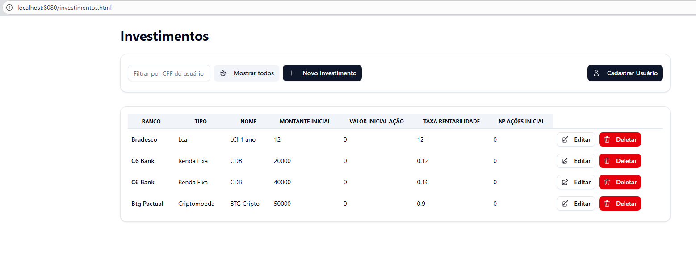
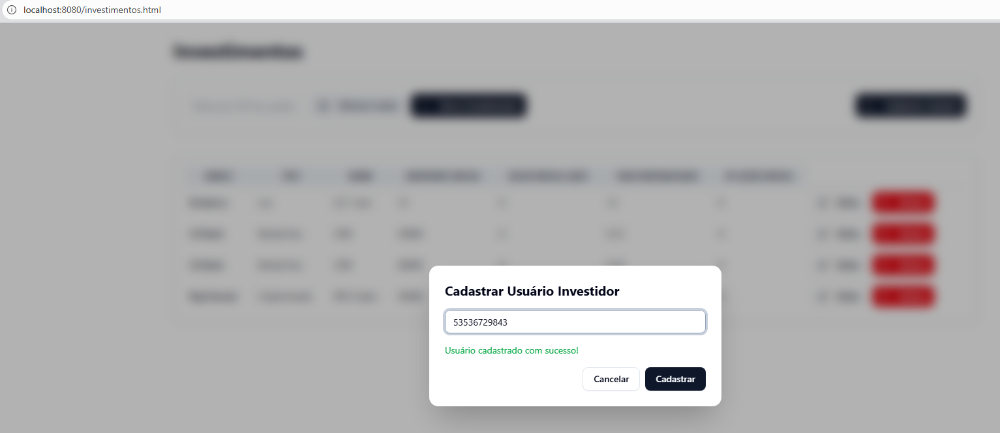
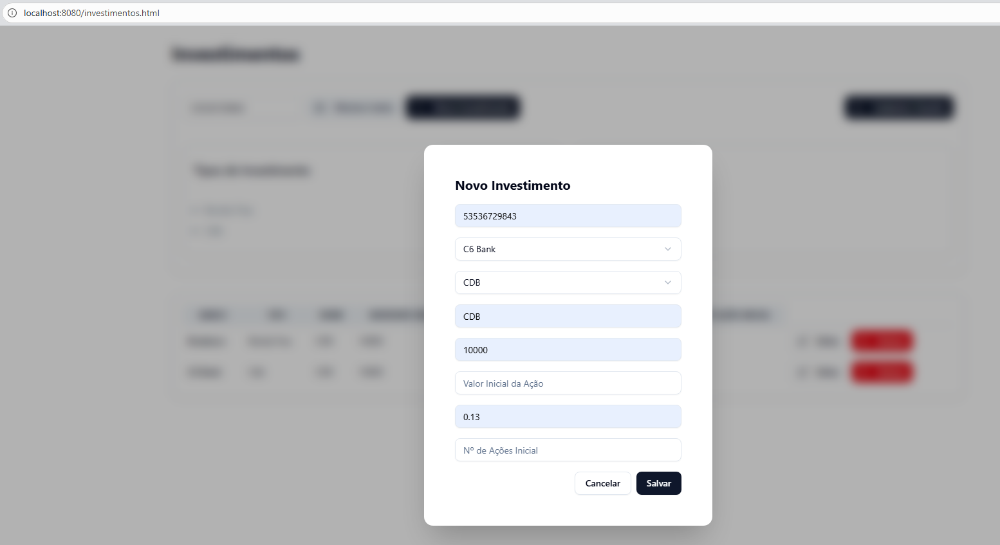
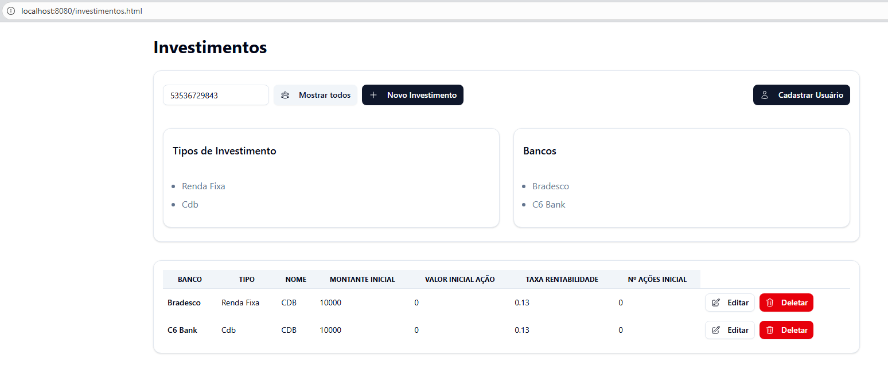
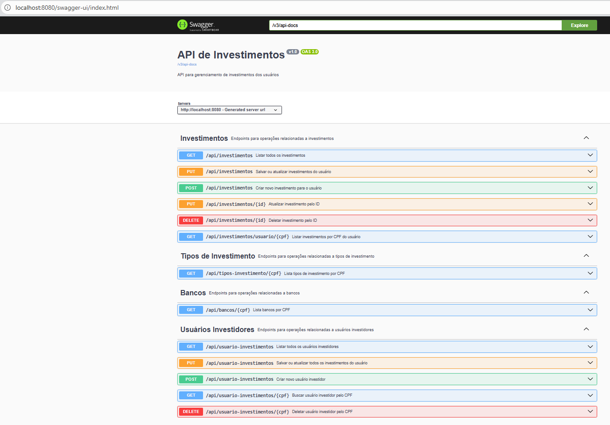
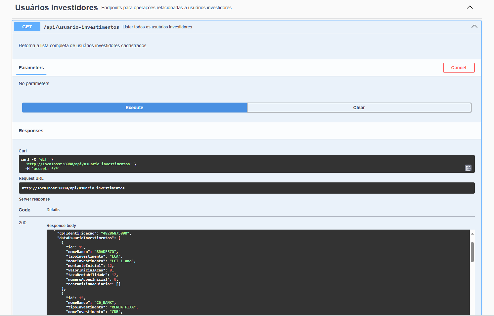
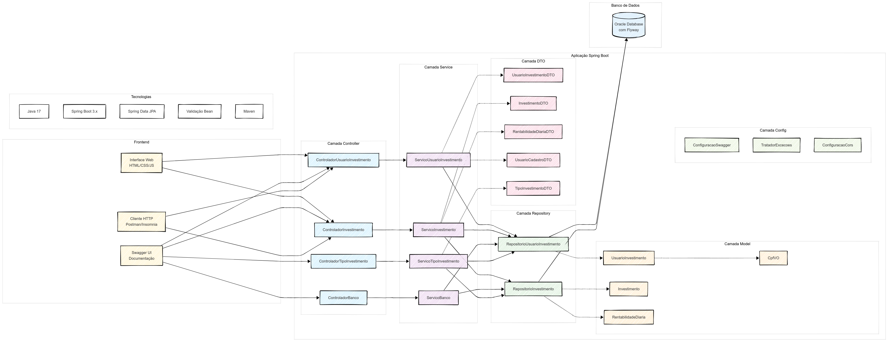
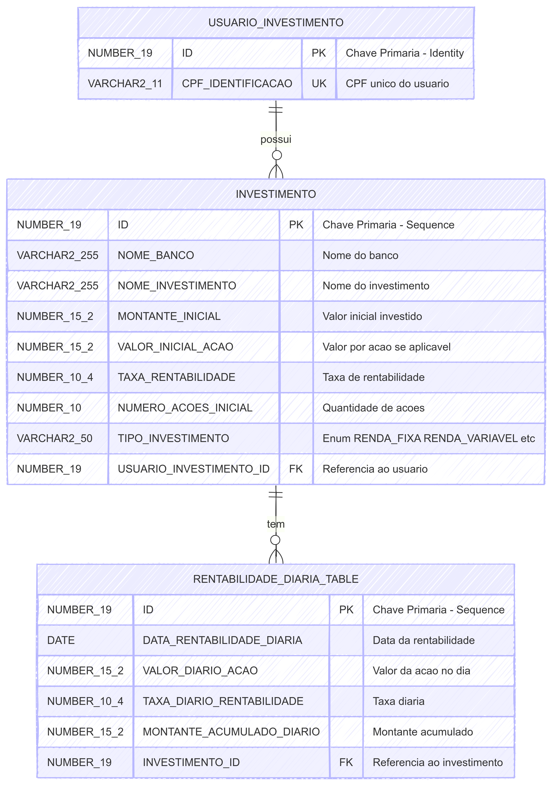

# Investaê 🚀

O objetivo do **Investaê** é ser seu assessor de investimentos completo, conectando todos os seus bancos e rentabilidades em um único lugar. Chega de ficar acessando vários apps!  
Esta API faz parte do nosso app mobile, centralizando seus investimentos, orientando suas decisões e tornando tudo simples, visual e inteligente.

Foi aí que decidimos criar o Investaê:  
Um app que centraliza seus investimentos, te orienta e torna tudo simples, visual e inteligente.

---

## 🆕 Novidades e Funcionalidades Recentes
- Autenticação de usuários implementada.
- Restrição de acesso ao Swagger apenas para o administrador.
- Cadastro e login de usuários investidores.
- Novos endpoints para consulta, cadastro, atualização e autenticação de usuários.
- Interface web aprimorada para testes e visualização dos dados.
- Melhorias na segurança das rotas e tratamento de erros.

### Credenciais de acesso
- **Administrador (acesso ao Swagger):**
  - Usuário: `admin`
  - Senha: `admin123`
- **Usuário de teste:**
  - Usuário: `julia`
  - Senha: `julia123`

---

## 📚 Sumário

- [Sobre o Projeto](#sobre-o-projeto)
- [👥 Integrantes](#integrantes)
- [🛠️ Tecnologias Utilizadas](#tecnologias-utilizadas)
- [▶️ Como Executar](#como-executar)
- [📁 Estrutura do Projeto](#estrutura-do-projeto)
- [📝 Documentação da API (Swagger)](#documentação-da-api-swagger)
- [🔗 Endpoints e Exemplos de Testes](#endpoints-e-exemplos-de-testes)
  - [Autenticação](#autenticação)
  - [Usuários Investidores](#usuários-investidores)
  - [Investimentos](#investimentos)
  - [Bancos](#bancos)
  - [Tipos de Investimento](#tipos-de-investimento)
- [🏗️ Arquitetura e Diagramas](#arquitetura-e-diagramas)
- [⚙️ Regras de Negócio](#regras-de-negócio)
- [⚠️ Tratamento de Erros](#tratamento-de-erros)
- [💡 Padrões e Boas Práticas](#padrões-e-boas-práticas)
- [📝 Licença](#licença)

---

## Sobre o Projeto

O **Investaê** é uma API RESTful para cadastro de usuários investidores, seus investimentos, rentabilidades diárias, bancos e tipos de investimento.  
O projeto segue boas práticas de arquitetura, separação de camadas, uso de DTOs, tratamento de erros e documentação automática.  
Esta API está integrada ao nosso aplicativo mobile, proporcionando uma experiência centralizada e inteligente para o investidor.

Repositório oficial: [https://github.com/JuliaAzevedoLins/Sprint4_Java_Investae](https://github.com/JuliaAzevedoLins/Sprint4_Java_Investae)

---

## 👥 Integrantes

|        Nome Completo         |  RMs  |
|------------------------------|-------|
| André Lambert                | 99148 |
| Felipe Cortez                | 99750 |
| Julia Azevedo Lins           | 98690 |
| Luis Gustavo Barreto Garrido | 99210 |
| Victor Hugo Aranda Forte     | 99667 |

---

## 🛠️ Tecnologias Utilizadas

- **Java 17** - Linguagem de programação principal
- **Spring Boot 3.x** - Framework principal para desenvolvimento da API
- **Spring Data JPA** - Abstração para acesso a dados e mapeamento objeto-relacional
- **Spring Web** - Desenvolvimento de APIs RESTful
- **Spring Validation** - Validação de dados de entrada
- **Spring Security** - Autenticação e autorização de usuários
- **JWT (JSON Web Token)** - Gerenciamento de tokens de autenticação
- **Oracle Database** - Banco de dados principal (pode ser adaptado para H2)
- **Flyway** - Gerenciamento de migrações do banco de dados
- **Swagger/OpenAPI 3** - Documentação automática da API
- **JUnit 5** - Framework de testes unitários
- **Maven** - Gerenciamento de dependências e build

---

## ▶️ Como Executar

1. **Clone o repositório:**
   ```sh
   git clone https://github.com/JuliaAzevedoLins/ChallengeXP_Java.git
   cd ChallengeXP_Java
   ```

2. **Configure o banco de dados Oracle no arquivo `src/main/resources/application.properties`.**
   > Para testes locais, pode ser adaptado para H2.

3. **Execute a aplicação:**
   ```sh
   ./mvnw spring-boot:run
   ```
   ou
   ```sh
   mvn spring-boot:run
   ```

4. **Acesse a documentação Swagger e Interface Web:**
   - [http://localhost:8080/swagger-ui/index.html](http://localhost:8080/swagger-ui/index.html)
   - [http://localhost:8080/investae-home.html](http://localhost:8080/investae-home.html)

---

## 📁 Estrutura do Projeto

```
src/
├── main/
│   ├── java/
│   │   └── com/
│   │       └── challenge/
│   │           └── investimentos/
│   │               └── investimentos_api/
│   │                   ├── config/
│   │                   │   ├── CorsConfig.java
│   │                   │   ├── RestExceptionHandler.java
│   │                   │   ├── SecurityConfig.java
│   │                   │   └── SwaggerConfig.java
│   │                   ├── controller/
│   │                   │   ├── AuthController.java
│   │                   │   ├── BancoController.java
│   │                   │   ├── InvestimentoController.java
│   │                   │   ├── TipoInvestimentoController.java
│   │                   │   └── UsuarioInvestimentoController.java
│   │                   ├── dto/
│   │                   │   ├── InvestimentoDTO.java
│   │                   │   ├── RentabilidadeDiariaDTO.java
│   │                   │   ├── TipoInvestimentoDTO.java
│   │                   │   ├── UsuarioCadastroDTO.java
│   │                   │   └── UsuarioInvestimentoDTO.java
│   │                   ├── enums/
│   │                   │   ├── BancoEnum.java
│   │                   │   └── TipoInvestimentoEnum.java
│   │                   ├── exception/
│   │                   │   └── // ...exceções customizadas
│   │                   ├── model/
│   │                   │   ├── Banco.java
│   │                   │   ├── CpfVO.java
│   │                   │   ├── Investimento.java
│   │                   │   ├── RentabilidadeDiaria.java
│   │                   │   └── UsuarioInvestimento.java
│   │                   ├── repository/
│   │                   │   ├── InvestimentoRepository.java
│   │                   │   └── UsuarioInvestimentoRepository.java
│   │                   ├── security/
│   │                   │   ├── JwtAuthenticationFilter.java
│   │                   │   ├── JwtService.java
│   │                   │   ├── UserDetailsServiceImpl.java
│   │                   │   └── // ...outros arquivos de segurança
│   │                   ├── service/
│   │                   │   ├── BancoService.java
│   │                   │   ├── InvestimentoService.java
│   │                   │   ├── TipoInvestimentoService.java
│   │                   │   ├── UsuarioInvestimentoService.java
│   │                   │   └── interfaces/
│   │                   │       └── // ...interfaces de serviço
│   │                   └── InvestimentosApiApplication.java
│   └── resources/
│       ├── application.properties
│       ├── application-oracle.properties
│       ├── db/
│       │   └── migration/
│       │       ├── V1__init.sql
│       │       ├── V2__create_usuario_table.sql
│       │       ├── V3__add_data_investimento.sql
│       │       ├── V4__insert_admin_user.sql
│       │       └── V6__admin_cpf_dados_exemplo.sql
│       └── static/
│           ├── index.html
│           └── investae-home.html
├── test/
│   ├── java/
│   │   └── com/
│   │       └── challenge/
│   │           └── investimentos/
│   │               └── investimentos_api/
│   │                   ├── config/
│   │                   ├── controller/
│   │                   ├── integration/
│   │                   ├── service/
│   │                   └── InvestimentosApiApplicationTests.java
│   └── resources/
│       └── application-test.properties
```

---

## 📝 Documentação da API (Swagger)

Acesse a documentação interativa em:  
[http://localhost:8080/swagger-ui/index.html](http://localhost:8080/swagger-ui/index.html)

> ⚠️ **Atenção:** O acesso ao Swagger está restrito apenas ao usuário administrador (`admin`). Utilize as credenciais acima para acessar.
> Para testar o login de usuário comum, utilize as credenciais de teste acima.
>
> **Como liberar os endpoints no Swagger:**
> 1. Acesse o endpoint de autenticação (`/api/auth/login`) e faça o login como admin.
> 2. O token JWT será gerado na resposta.
> 3. Copie o token e clique em "Authorize" no Swagger UI, colando o token no campo apropriado.
> 4. Após autorizar, todos os endpoints protegidos estarão liberados para o admin.
>
> *No HTML de testes, a verificação é feita automaticamente no login, não sendo necessário inserir o token manualmente.*

### 🌐 Interface Web de Demonstração

Desenvolvemos uma interface web simples para demonstrar o consumo da API de forma visual e interativa. Esta interface permite testar o fluxo completo da aplicação seguindo os passos básicos de uso.

#### 📋 Passo 1: Tela Principal
A interface apresenta uma tabela para visualizar investimentos e botões para as principais ações.



*Esta tela mostra a interface inicial onde podemos cadastrar usuários, criar investimentos e filtrar por CPF. Note os botões de ação disponíveis para gerenciar o sistema.*

#### 👤 Passo 2: Cadastro de Usuário
O primeiro passo é cadastrar um usuário investidor. Clique em "Cadastrar Usuário" para abrir o formulário que solicita apenas o CPF do usuário.



*Formulário simples para cadastro de usuário. O sistema valida o CPF e cria o usuário investidor no banco de dados através da API.*

#### 💰 Passo 3: Cadastro de Investimentos
Após ter um usuário cadastrado, podemos adicionar investimentos. O formulário permite inserir todos os dados do investimento incluindo banco, tipo, valores e rentabilidades.



*Formulário completo para cadastro de investimentos. Aqui definimos o banco, tipo de investimento, valores iniciais e podemos adicionar rentabilidades diárias.*

#### 📊 Passo 4: Visualização dos Dados
Com usuários e investimentos cadastrados, a tabela principal exibe todos os dados organizados. É possível filtrar por CPF específico ou visualizar todos os investimentos.



*Tabela populada com investimentos. Mostra como os dados são organizados e apresentados ao usuário final, facilitando a visualização e gestão dos investimentos.*

### 📸 Interface Swagger - Documentação Técnica

A documentação da API é totalmente interativa através do Swagger UI, permitindo testar todos os endpoints diretamente pelo navegador. Esta é a ferramenta técnica para desenvolvedores testarem e integrarem com a API.

#### 📖 Visão Geral da API
A página principal do Swagger apresenta todos os controllers organizados por funcionalidade, mostrando a estrutura completa da API. Aqui você pode ver todos os endpoints disponíveis organizados por categoria.



*Visão geral da API com todos os controllers disponíveis. Cada seção agrupa endpoints relacionados: Usuários Investidores, Investimentos, Bancos e Tipos de Investimento. Note a interface limpa e organizada do Swagger UI.*

#### 👥 Endpoints de Usuários Investidores
Ao expandir o controller de "Usuários Investidores", você pode ver todos os endpoints fundamentais para gerenciar usuários. Este controller é a base do sistema, onde você encontra operações de CRUD completo para usuários investidores.



*Controller de Usuários Investidores expandido mostrando os endpoints disponíveis. Destaque para o endpoint GET /api/usuario-investimentos que lista todos os usuários cadastrados. Cada endpoint possui descrição clara de sua funcionalidade.*

#### Funcionalidades do Swagger UI
O Swagger oferece uma interface completa para testar a API:

- **Documentação Interativa**: Cada endpoint possui descrição detalhada, parâmetros e exemplos
- **Try it Out**: Botão para testar endpoints diretamente no navegador
- **Schemas**: Visualização completa dos modelos de dados (DTOs)
- **Responses**: Exemplos de respostas para cada código de status HTTP
- **Authentication**: Suporte para diferentes tipos de autenticação quando necessário

**💼 Para os demais controllers (Investimentos, Bancos, Tipos de Investimento):**
Cada um segue o mesmo padrão de organização, com endpoints específicos para suas respectivas funcionalidades. O controller de Investimentos é o mais robusto, oferecendo operações completas de CRUD, enquanto Bancos e Tipos de Investimento são principalmente para consultas derivadas dos investimentos cadastrados.

---

## 🔗 Endpoints e Exemplos de Testes

### 🔑 Autenticação

#### 🔒 Login
- **POST** `/api/auth/login`
- **Body:**
  ```json
  {
    "username": "admin",
    "password": "admin123"
  }
  ```
- **Resposta:** `200 OK`
  ```json
  {
    "token": "<JWT_TOKEN>"
  }
  ```

#### 🔓 Registrar novo usuário
- **POST** `/api/auth/register`
- **Body:**
  ```json
  {
    "username": "julia",
    "password": "julia123"
  }
  ```
- **Resposta:** `201 Created`
  ```json
  "Usuário registrado com sucesso."
  ```

### 👤 Usuários Investidores

#### ➕ Criar novo usuário investidor

- **POST** `/api/usuario-investimentos`
- **Body:**
  ```json
  {
    "cpfIdentificacao": "12345678900"
  }
  ```
- **Resposta:** `200 OK`
  ```json
  "Usuário criado com sucesso."
  ```

#### 📋 Listar todos os usuários investidores

- **GET** `/api/usuario-investimentos`
- **Resposta:** `200 OK`
  ```json
  [
    {
      "id": 1,
      "cpfIdentificacao": "12345678900",
      "investimentos": []
    }
  ]
  ```

#### 🔍 Buscar usuário investidor por CPF

- **GET** `/api/usuario-investimentos/{cpf}`
- **Resposta:** `200 OK`
  ```json
  {
    "id": 1,
    "cpfIdentificacao": "12345678900",
    "investimentos": [ ... ]
  }
  ```

#### � Salvar ou atualizar todos os investimentos do usuário

- **PUT** `/api/usuario-investimentos`
- **Body:**
  ```json
  {
    "cpfIdentificacao": "12345678900",
    "investimentos": [
      {
        "nomeBanco": "C6 Bank",
        "tipoInvestimento": "RENDA_FIXA",
        "nomeInvestimento": "Tesouro Selic",
        "montanteInicial": 1000.0,
        "valorInicialAcao": 0.0,
        "taxaRentabilidade": "0.12",
        "numeroAcoesInicial": 0,
        "rentabilidadeDiaria": [
          {
            "dataRentabilidadeDiaria": "19-05-2025",
            "valorDiarioAcao": 0.0,
            "taxaDiarioRentabilidade": "0.12",
            "montanteAcumuladoDiario": 1120.0
          }
        ]
      }
    ]
  }
  ```
- **Resposta:** `200 OK`
  ```json
  "Investimentos salvos com sucesso"
  ```

#### �🗑️ Deletar usuário investidor por CPF

- **DELETE** `/api/usuario-investimentos/{cpf}`
- **Resposta:** `200 OK`
  ```json
  "Usuário e seus investimentos foram deletados."
  ```

---

### 💰 Investimentos

#### ➕ Criar novo investimento para um usuário

- **POST** `/api/investimentos`
- **Body:**
  ```json
  {
    "cpfIdentificacao": "12345678900",
    "dataUsuarioInvestimentos": [
      {
        "nomeBanco": "C6 Bank",
        "tipoInvestimento": "RENDA_FIXA",
        "nomeInvestimento": "Tesouro Selic",
        "montanteInicial": 1000.0,
        "valorInicialAcao": 0.0,
        "taxaRentabilidade": "0.12",
        "numeroAcoesInicial": 0,
        "rentabilidadeDiaria": [
          {
            "dataRentabilidadeDiaria": "19-05-2025",
            "valorDiarioAcao": 0.0,
            "taxaDiarioRentabilidade": "0.12",
            "montanteAcumuladoDiario": 1120.0
          }
        ]
      }
    ]
  }
  ```
- **Resposta:** `201 Created`
  ```json
  "Investimento criado com sucesso"
  ```

#### 🔄 Salvar ou atualizar investimentos do usuário

- **PUT** `/api/investimentos`
- **Body:** (igual ao POST de investimento)
- **Resposta:** `200 OK`
  ```json
  "Investimentos salvos com sucesso"
  ```

#### 📋 Listar todos os investimentos

- **GET** `/api/investimentos`
- **Resposta:** `200 OK`
  ```json
  [
    {
      "id": 1,
      "nomeBanco": "C6 Bank",
      "tipoInvestimento": "RENDA_FIXA",
      "nomeInvestimento": "Tesouro Selic",
      "montanteInicial": 1000.0,
      "valorInicialAcao": 0.0,
      "taxaRentabilidade": "0.12",
      "numeroAcoesInicial": 0,
      "rentabilidadeDiaria": [ ... ]
    }
  ]
  ```

#### 🔍 Listar investimentos por CPF do usuário

- **GET** `/api/investimentos/usuario/{cpf}`
- **Resposta:** `200 OK`
  ```json
  [
    {
      "id": 1,
      "nomeBanco": "C6 Bank",
      "tipoInvestimento": "RENDA_FIXA",
      "nomeInvestimento": "Tesouro Selic",
      "montanteInicial": 1000.0,
      "valorInicialAcao": 0.0,
      "taxaRentabilidade": "0.12",
      "numeroAcoesInicial": 0,
      "rentabilidadeDiaria": [ ... ]
    }
  ]
  ```

#### ✏️ Atualizar investimento pelo ID

- **PUT** `/api/investimentos/{id}`
- **Body:**
  ```json
  {
    "nomeBanco": "Itaú",
    "tipoInvestimento": "RENDA_VARIAVEL",
    "nomeInvestimento": "Ações PETR4",
    "montanteInicial": 2000.0,
    "valorInicialAcao": 25.50,
    "taxaRentabilidade": "0.0",
    "numeroAcoesInicial": 78
  }
  ```
- **Resposta:** `200 OK`
  ```json
  "Investimento atualizado com sucesso"
  ```

#### 🗑️ Deletar investimento pelo ID

- **DELETE** `/api/investimentos/{id}`
- **Resposta:** `200 OK`
  ```json
  "Investimento deletado com sucesso"
  ```

---

### 🏦 Bancos

#### 📋 Listar bancos por CPF

- **GET** `/api/bancos/{cpf}`
- **Resposta:** `200 OK`
  ```json
  [
    {
      "nomeBanco": "C6 Bank"
    }
  ]
  ```

---

### 📊 Tipos de Investimento

#### 📋 Listar tipos de investimento por CPF

- **GET** `/api/tipos-investimento/{cpf}`
- **Resposta:** `200 OK`
  ```json
  [
    {
      "tipoInvestimento": "RENDA_FIXA"
    }
  ]
  ```

---

## 🏗️ Arquitetura e Diagramas

### 📊 Diagrama de Arquitetura

O projeto segue uma arquitetura em camadas bem definida, seguindo os princípios do Spring Boot e boas práticas de desenvolvimento:



**Camadas da Aplicação:**
- **Controller**: Responsável por receber requisições HTTP, validar dados de entrada e retornar respostas padronizadas
- **Service**: Contém a lógica de negócio, regras de validação e coorderação entre diferentes repositórios
- **Repository**: Interface de acesso aos dados, utilizando Spring Data JPA para abstrair operações com banco de dados
- **Model**: Entidades JPA que representam as tabelas do banco de dados
- **DTO**: Objetos de transferência de dados para comunicação entre camadas
- **Config**: Configurações da aplicação (Swagger, CORS, Exception Handler)

### 🗄️ Diagrama de Entidade-Relacionamento (ER)

O banco de dados é estruturado com relacionamentos bem definidos para garantir integridade referencial:



**Entidades Principais:**
- **USUARIO_INVESTIMENTO**: Armazena dados dos usuários investidores (ID, CPF)
- **INVESTIMENTO**: Dados dos investimentos (nome, tipo, valores, banco, etc.)
- **RENTABILIDADE_DIARIA_TABLE**: Histórico diário de rentabilidade de cada investimento

**Relacionamentos:**
- Um usuário pode ter múltiplos investimentos (1:N)
- Um investimento pode ter múltiplas rentabilidades diárias (1:N)
- Cascata de exclusão: ao deletar usuário, deleta investimentos e rentabilidades

---

## ⚙️ Regras de Negócio

- **Admin:**
  - Visualiza todos os usuários, investimentos, bancos e tipos de investimento.
  - Pode realizar CRUD completo em qualquer usuário ou investimento.
  - Tem acesso total a todos os endpoints e funcionalidades da API.

- **Usuário comum:**
  - Visualiza apenas seus próprios dados e investimentos.
  - Pode realizar CRUD completo apenas nos seus próprios investimentos e perfil.
  - Não tem acesso aos dados de outros usuários.

- **Centralização e Consulta:** O Investaê centraliza todos os investimentos do usuário, permitindo visualizar e gerenciar aplicações de diferentes bancos em um só lugar.
- **Cadastro e Gerenciamento:** Apenas usuários investidores podem cadastrar, atualizar ou remover seus próprios investimentos.
- **Rentabilidade Diária:** Cada investimento pode ter uma ou mais rentabilidades diárias associadas, permitindo o acompanhamento detalhado da evolução.
- **Bancos e Tipos de Investimento são apenas consultáveis:**  
  Os controllers de **Banco** (`/api/bancos`) e **Tipo de Investimento** (`/api/tipos-investimento`) possuem apenas métodos GET, pois, pela regra de negócio, bancos e tipos de investimento são derivados dos investimentos cadastrados pelo usuário. Não é permitido criar, editar ou remover bancos ou tipos de investimento diretamente via API — eles são sempre obtidos a partir dos investimentos já registrados.
- **Validação e Segurança:** Todos os dados são validados e tratados para garantir integridade e segurança das informações.

---

## ⚠️ Tratamento de Erros

- **Campos obrigatórios:** Retorna `400 Bad Request` com mensagem clara.
- **Enum inválido:** Retorna `400 Bad Request` e lista os valores permitidos.
- **Usuário ou investimento não encontrado:** Retorna `404 Not Found`.
- **Acesso negado:** Retorna `403 Forbidden` quando o usuário tenta acessar ou modificar dados que não tem permissão (exemplo: usuário comum tentando acessar dados de outro usuário ou endpoints restritos ao admin).
- **Erro interno:** Retorna `500 Internal Server Error`.

Exemplo de erro para enum inválido:
```json
{
  "message": "Valor inválido para o campo TipoInvestimento. Valores permitidos: [RENDA_FIXA, RENDA_VARIAVEL, TESOURO_DIRETO, CRIPTOMOEDA, FUNDO_IMOBILIARIO, CDB, LCI, LCA, OUTRO]."
}
```

Exemplo de erro para acesso negado:
```json
{
  "message": "Acesso negado. Você não tem permissão para acessar este recurso."
}
```

---

## 💡 Padrões e Boas Práticas

- **Separação de camadas:** Controller, Service, Repository, DTO, Model.
- **Uso de DTOs:** Nenhum endpoint retorna entidades diretamente.
- **Documentação Swagger/OpenAPI:** Todos os endpoints documentados.
- **Tratamento global de erros:** Classe `RestExceptionHandler`.
- **Enums para valores fixos:** Exemplo: `TipoInvestimentoEnum`.
- **JavaDoc:** Presente nas principais classes e métodos.

---

## 📝 Licença

Este projeto é livre para fins acadêmicos.

---
